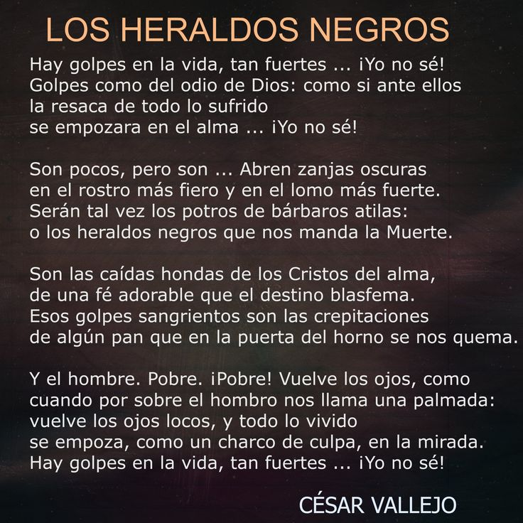
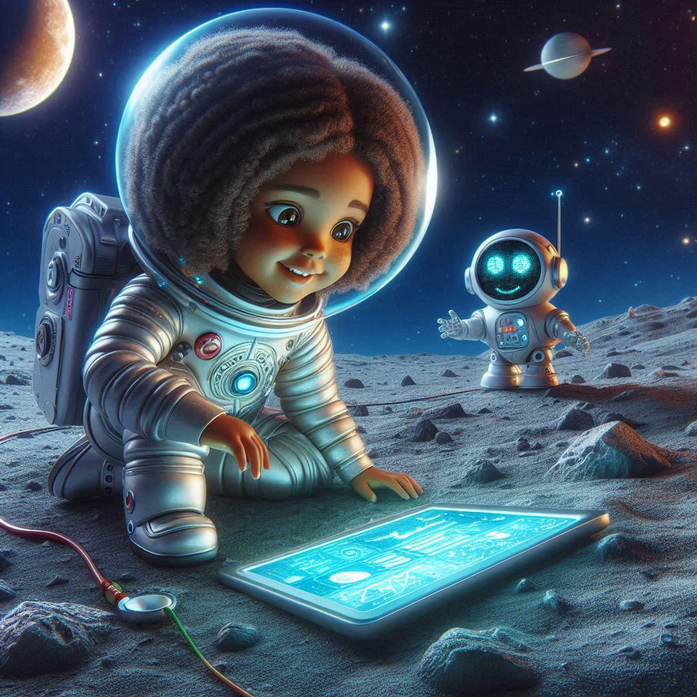
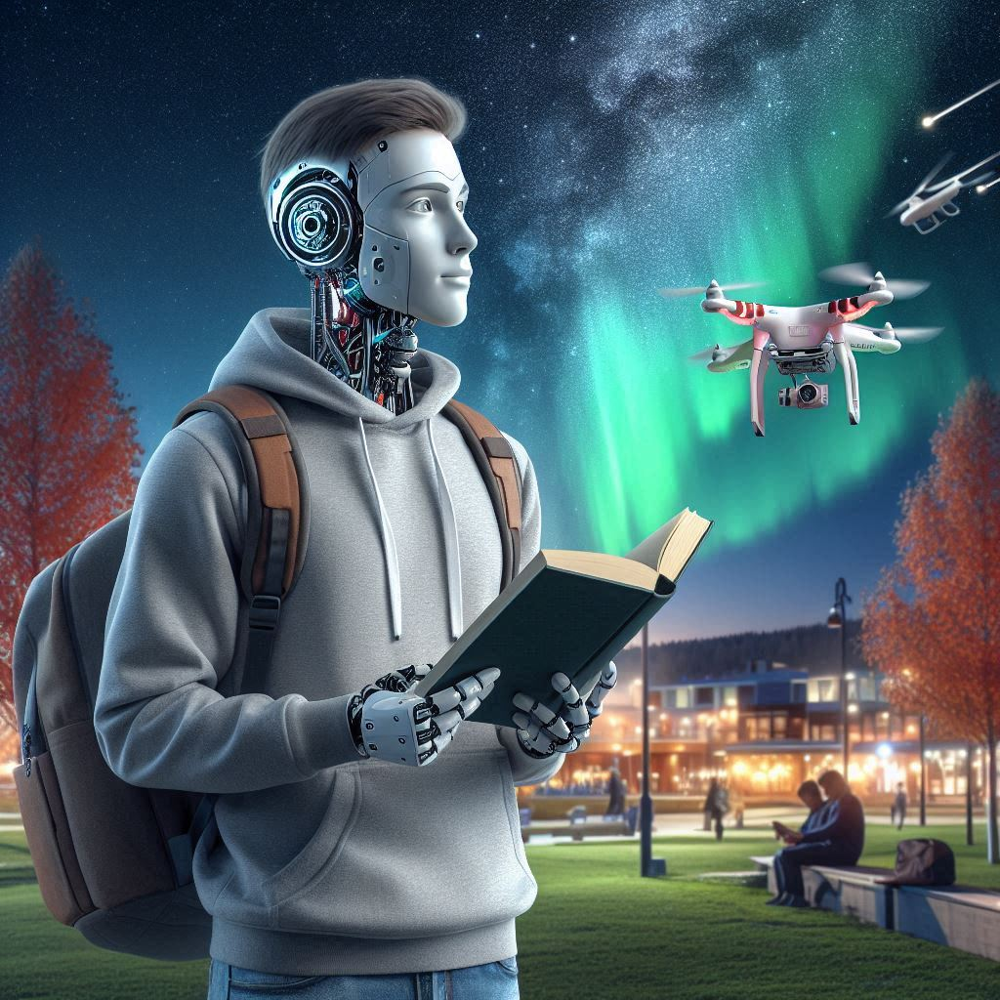
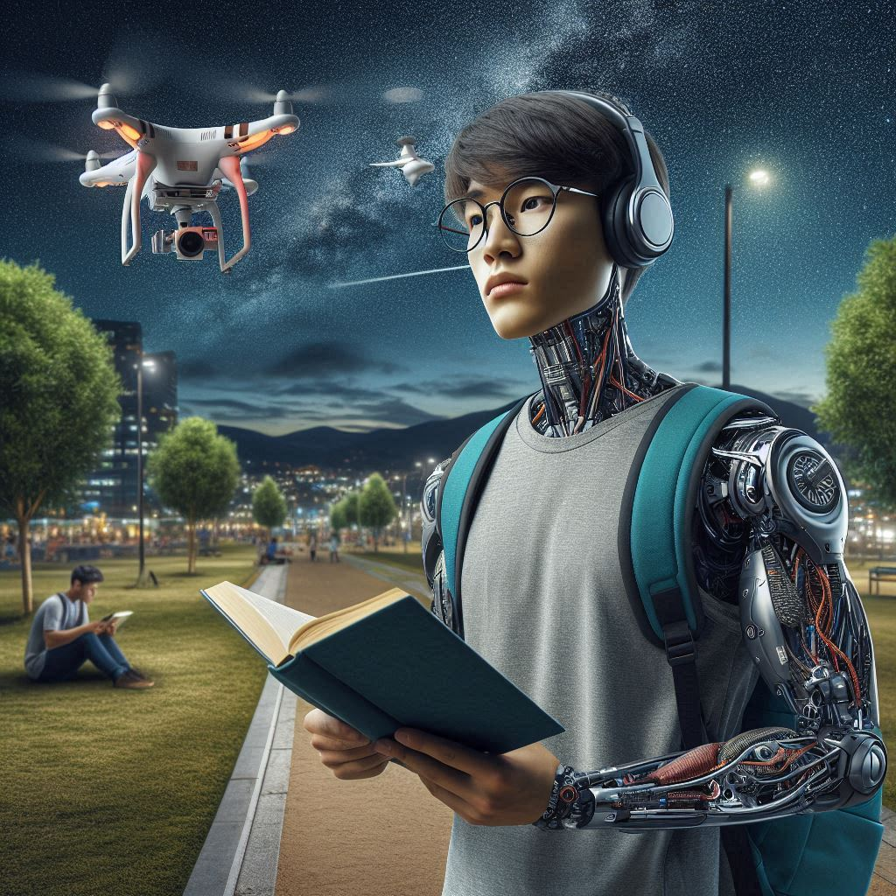
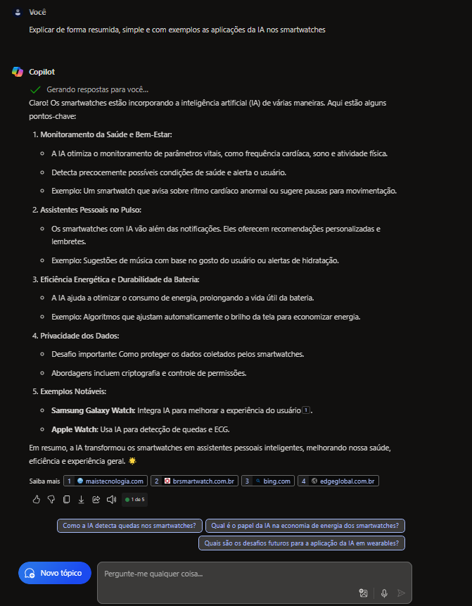

# 🤖 Explorando os Recursos de IA Generativa com Copilot e OpenAI 🤖

Desafio no lab  Explorando os Recursos de IA Generativa com Copilot e OpenAI

## 🎯 Objetivos 🎯

    1. Crie um novo repositório no github com um nome a sua preferência
    2. Crie uma pasta chamada 'inputs' e salve as imagens que você utilizou
    3. Crie uma pasta chamado 'output' e salve os resultados de reconhecimento de texto nessas imagens
    4. Crie um arquivo chamado readme.md , deixe alguns prints descreva o processo, alguns insights e possibilidades que você aprendeu durante o conteúdo.
    5. Compartilhe conosco o link desse repositório através do botão 'entregar projeto'

## Copilot

https://copilot.microsoft.com/

## Estrutura do Projeto

- `inputs/`: Contém as imagens utilizadas para reconhecimento de texto.
- `output/`: Contém os resultados do reconhecimento de texto para cada imagem da pasta `inputs`.
- `assets/`: Contém os resultados dos prompts usados nos testes de criação de imagens, geração de códigos e texto.

## Processo

✔️ **Aquisição das Imagens**: As imagens foram coletadas e salvas na pasta `inputs`.

✔️ **Reconhecimento, Tradução e Resumo de Texto**: Mediante o uso de prompts foi requerido extrair, trazudir e fazer um resumo sobre o texto das imagens.

✔️ **Salvamento dos Resultados**: Os textos extraídos de imagens foram salvos na pasta `output`.

✔️ **Criação de imagens, textos e códigos**: Mediante o uso de prompts foi requerido criar imagens, gerar códigos em JS e gerar textos com explicaçóes simples e concretas.

## Possibilidades

- **Automação de Tarefas**: O reconhecimento de texto em imagens pode ser usado para automatizar a entrada de dados de documentos digitalizados.

- **Análise de Documentos**: Pode ser usado para digitalizar e indexar grandes volumes de documentos para facilitar a busca e análise.

## Prints

### `Exemplos de Imagem de Entrada`

### `📚 Resultados do Reconhecimento de Texto`

✔️ Poema 15 - Pablo Neruda

[Saida 1: Reconhecimento de Texto de Imagem](output/extrair_texto_poema15.png)

✔️ Los Heraldo Negros - César Vallejo

[Saida 1: Reconhecimento de Texto de Imagem](output/extrair_texto(1).png)

[Saida 2: Reconhecimento de Texto de Imagem](output/extrair_texto(2).png)

[Saida 3: Tradução de Texto da Imagem](output/traduzir_EN.png)

[Saida 4: Resumo](output/resumo.png)

### `👨🏼‍💻 Usando o Copilot para criar códigos em linguagens de programação`

Foi requerido explicar como gerar o código do jogo da cobrinha em JS e dar um exemplo do código completo

.png)

.png)

.png)

### `🖼️ Usando o Copilot para criar imagens`
A criação de imagens foi feita usando a tecnologia do Dall-E.

 ✔️ Primeiro foi requerido criar a imagem de uma criança brincando na lua com um computador e um robô

✔️ Depois foi requerido criar a imagem de um jovem estudante com carateristicas fisicas humanas e roboticas, usando roupa esportiva e uma mochila lendo um livro, fundo de um parque moderno a noite com um ceu cheio de estrelas, a aurorea boreal e com um drone voando no ceu.

 

### `Usando o Copilot para procurar conteúdo e redatar resumos com exemplos`

Foi requerido explicar de forma resumida, simples e com exemplos as aplicações da IA nos smartwatches

## 💭 Reflexão

Aprendi diversas vantagens que a IA oferece, por exemplo:

 ✔️ Otimização de tempo e resultados.

 ✔️ Redução de erros.

 ✔️ Melhoria na qualidade do código.

 ✔️ Aumento de produtividade.

 ✔️ Facilitação de aprendizado e adaptação.

 ✔️ Assintência na tomada de decisões.

